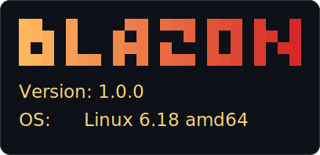
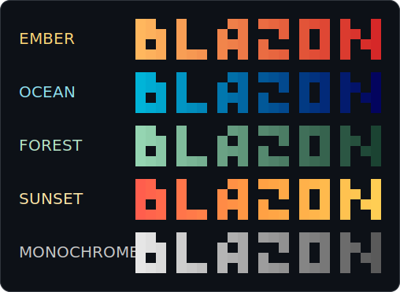
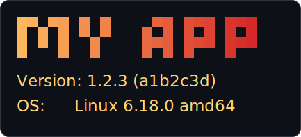

<p align="center">
  
</p>

# Blazon

[](https://github.com/heutelbeck/blazon/actions/workflows/ci.yml)
[](https://central.sonatype.com/artifact/com.heutelbeck/blazon)
[](LICENSE)


A tiny, zero-dependency Java library for drawing gradient ANSI terminal banners
from a pluggable block font. A *blazon* is the formal description of a heraldic
banner; this one also happens to *blaze* with colour.

It is the reusable extraction of the near-identical startup banners used across
several services: a per-character truecolor gradient painted over half-block
glyph lettering, plus a couple of metadata lines, with a plain fallback for
non-interactive output.

> Banners in this README are rendered as SVG images, since that is how the
> truecolor output actually looks on a terminal. The neutral grey ones simply
> illustrate spacing and glyph shapes.

## Contents

- [Install](#install)
- [Quick start](#quick-start)
- [Core API](#core-api)
  - [The `Blazon` builder](#the-blazon-builder)
  - [Colours and gradients](#colours-and-gradients)
  - [Direction](#direction)
  - [Palettes](#palettes)
  - [Spacing and margin](#spacing-and-margin)
  - [Fonts](#fonts)
  - [Rendering and colour detection](#rendering-and-colour-detection)
- [Spring Boot](#spring-boot)
  - [Zero configuration](#zero-configuration)
  - [Configuration properties](#configuration-properties)
  - [Version and git commit](#version-and-git-commit)
  - [Manual configuration](#manual-configuration)
  - [How it works](#how-it-works)
- [Modules](#modules)
- [Demos](#demos)
- [Building](#building)
- [License](#license)

## Install

Java 17 or newer. Artifacts are on Maven Central under `com.heutelbeck` (see the
badge above for the latest version).

Core library (no runtime dependencies):

```xml
<dependency>
  <groupId>com.heutelbeck</groupId>
  <artifactId>blazon</artifactId>
  <version>0.1.0</version>
</dependency>
```

Spring Boot integration (pulls in `blazon`; `spring-boot` is expected from the
application):

```xml
<dependency>
  <groupId>com.heutelbeck</groupId>
  <artifactId>blazon-spring</artifactId>
  <version>0.1.0</version>
</dependency>
```

## Quick start

```java
import com.heutelbeck.blazon.Blazon;
import com.heutelbeck.blazon.Palettes;

var banner = Blazon.of("BLAZON")
    .palette(Palettes.SAPL)
    .margin(1)
    .line("Version: 1.0.0")
    .line("OS:      " + System.getProperty("os.name"))
    .render();

System.out.println(banner);
```



## Core API

Everything lives in the package `com.heutelbeck.blazon`. A `Blazon` is an
immutable description of a banner; the fluent methods each return a new instance,
so a configured banner can be shared and specialised safely.

### The `Blazon` builder

| Method | Effect | Default |
| --- | --- | --- |
| `Blazon.of(String)` | start a banner for the given text (spaces separate words) | — |
| `.font(Font)` | glyph font for the art | `Fonts.halfBlock()` |
| `.gradient(Gradient)` | gradient for the art | solid white |
| `.direction(Direction)` | axis the gradient is sampled along | `HORIZONTAL` |
| `.accent(Color)` | colour of the metadata lines | white |
| `.palette(Palette)` | set gradient and accent together | — |
| `.letterSpacing(int)` | blank cells between glyphs | `1` |
| `.wordSpacing(int)` | extra blank cells per space, on top of letter spacing | `2` |
| `.margin(int)` | blank cells prepended to every line | `0` |
| `.line(String)` | append a metadata line (may contain `${...}` placeholders) | none |
| `.render(...)` | produce the banner string (see below) | — |

`Blazon.of(null)` throws `NullPointerException`; negative spacing or margin
throws `IllegalArgumentException`.

### Colours and gradients

`Color` is an immutable 24-bit RGB value (`record Color(int red, int green, int
blue)`, each `0..255`). A `Gradient` maps a position `t` in `0..1` to a `Color`:

```java
Gradient.solid(new Color(80, 200, 220));                              // one colour everywhere
Gradient.linear(new Color(123, 189, 188), new Color(2, 131, 146));    // two-stop
Gradient.stops(new Color(255, 94, 77),
               new Color(255, 159, 67),
               new Color(255, 206, 84));                              // multi-stop, spread evenly
```

`Gradient` is a functional interface (`Color at(double t)`), so custom gradients
are just a lambda. `Color.mix(from, to, t)` interpolates and clamps `t`;
`color.foregroundAnsi()` gives the `ESC[38;2;r;g;bm` escape.

### Direction

The gradient is sampled across the glyph grid along one of three axes:

```java
Blazon.of("BLAZON").direction(Direction.HORIZONTAL); // left to right (default)
Blazon.of("BLAZON").direction(Direction.VERTICAL);   // top to bottom
Blazon.of("BLAZON").direction(Direction.DIAGONAL);   // top-left to bottom-right
```

### Palettes

A `Palette` bundles a `Gradient` and an accent `Color`. `Palettes` ships
ready-made themes, including the two this library was extracted from:



| Palette | Notes |
| --- | --- |
| `SAPL` | teal, accent `62,160,167` — SAPL node / playground |
| `PARATRON` | blue with a coral accent — Paratron gateway |
| `EMBER` | amber to red |
| `OCEAN` | sky to deep blue |
| `FOREST` | mint to pine |
| `SUNSET` | three-stop red / orange / gold |
| `MONOCHROME` | light to dark grey |

```java
Blazon.of("MY APP").palette(Palettes.PARATRON);
Palettes.byName("sapl");   // Optional<Palette>, case-insensitive lookup
```

Apply a whole theme with `.palette(...)`, or set the pieces independently with
`.gradient(...)` and `.accent(...)`.

### Spacing and margin

`letterSpacing` is the gap between glyphs; a space in the text adds `wordSpacing`
cells *on top of* that gap; `margin` indents every line.

```java
Blazon.of("TWO WORDS").render();                  // default word spacing (2)
```


```java
Blazon.of("TWO WORDS").wordSpacing(0).render();   // tight, like the original banners
```


```java
Blazon.of("WIDE").letterSpacing(3).render();
```


The original SAPL/Paratron banners used tight word spacing and a one-cell margin;
this reproduces `banner-plain.txt` byte-for-byte:

```java
Blazon.of("SAPL NODE").margin(1).wordSpacing(0).render();
```


### Fonts

The shipped font (`Fonts.halfBlock()`) is a compact two-row half-block face
covering the ASCII letters, digits and a little punctuation. Letters are rendered
upper case; unrepresented characters render as blank space.

```java
Blazon.of("0123456789").render();
```


`Font` is an interface (`int height()`, `Glyph glyph(char)`), so alternative faces
(including a figlet loader) can be added without touching the renderer; the
gradient painter colours cells regardless of which glyphs fill them.

### Rendering and colour detection

```java
String render();                                            // auto-detect colour
String render(ColorSupport colorSupport);                   // TRUECOLOR or NONE
String render(ColorSupport colorSupport,
              UnaryOperator<String> lineResolver);          // resolve ${...} in metadata lines
```

`ColorSupport.autoDetect()` follows the usual conventions: `NO_COLOR` disables
colour, `FORCE_COLOR` forces it, otherwise colour is on only when a console is
attached (so piped or redirected output stays free of escape codes). The returned
string never has a trailing newline.

## Spring Boot

The `blazon-spring` module adds a Spring Boot `Banner` and installs it
automatically.

### Zero configuration

Add the `blazon-spring` dependency and that is it — no code, no `banner.txt`. The
text is derived from `spring.application.name` (upper-cased, dashes and
underscores become spaces), and version/OS metadata lines are added from the
environment:

```properties
spring.application.name=my-app
spring.application.version=1.2.3
```

renders:



If no name is configured it falls back to the main application class name. If the
application provides its own `banner.txt`, Spring Boot's precedence keeps it.

### Configuration properties

All optional, bound from `blazon.*`:

```properties
blazon.text=My App        # explicit text, used verbatim (skips name derivation)
blazon.palette=PARATRON   # any name from Palettes; default SAPL
blazon.color=truecolor    # AUTO (default), TRUECOLOR or NONE
blazon.margin=1           # left indent; default 1
blazon.metadata=true      # include the Version/OS lines; default true
blazon.enabled=false      # opt out entirely
```

### Version and git commit

The `Version:` line mirrors the original banners: the version comes from
`spring.application.version` (or `git.build.version` if that is unset), and the
git commit is appended as `(<commit>)` automatically when `git.commit.id.abbrev`
is on the environment. To provide it, add the git-commit-id plugin and import the
file it generates:

```xml
<plugin>
  <groupId>io.github.git-commit-id</groupId>
  <artifactId>git-commit-id-maven-plugin</artifactId>
  <configuration>
    <generateGitPropertiesFile>true</generateGitPropertiesFile>
    <failOnNoGitDirectory>false</failOnNoGitDirectory>
  </configuration>
</plugin>
```

```properties
spring.config.import=optional:classpath:git.properties
```

That is all: with `git.properties` on the classpath the `Version:` line gains the
commit, no further configuration. (`blazon-spring-demo` is wired up exactly this
way.)

### Manual configuration

For full control, set `blazon.enabled=false` and drive it yourself. Placeholders
in `line(...)` are resolved against the Spring `Environment` at print time:

```java
public static void main(String[] args) {
    var blazon = Blazon.of("MY APP")
        .palette(Palettes.PARATRON)
        .line("Version: ${spring.application.version}")
        .line("OS:      ${os.name} ${os.version} ${os.arch}");

    var application = new SpringApplication(MyApplication.class);
    application.setBanner(new BlazonBanner(blazon));
    application.run(args);
}
```

### How it works

A banner is printed before the application context exists, so an
`@AutoConfiguration` bean would be too late. Blazon installs itself from an
`EnvironmentPostProcessor` that runs after configuration data is loaded but before
the banner is drawn, reads the properties above, and calls
`SpringApplication.setBanner(...)`. It is registered via
`META-INF/spring.factories`. Because it generates glyphs in code rather than from
resources, no native-image resource hints are needed.

## Modules

| Module | Purpose | Runtime dependencies |
| --- | --- | --- |
| `blazon` | core: block font, gradient painter, banner builder | none |
| `blazon-spring` | Spring Boot `Banner` adapter with `${...}` and auto-install | `spring-boot` (provided) |

`blazon-parent` is a build aggregator only: it coordinates the reactor build and
is not the Maven parent of the modules.

## Demos

Two runnable demos live under `demos/` (not published to Maven Central). Install
the libraries locally once, then run either:

```
mvn install -DskipTests
mvn -q -pl demos/blazon-plain-demo exec:java
mvn -q -pl demos/blazon-spring-demo spring-boot:run
```

- `blazon-plain-demo` prints "BLAZON BANNERS" in a range of palettes, directions
  and spacings, showing the settings next to each example, then the full
  default-font glyph set (letters and digits) six per row.
- `blazon-spring-demo` is a minimal Spring Boot app with no banner code at all; it
  relies on the zero-configuration auto-banner (wired to git-commit-id) and exits.

## Building

```
mvn verify
```

Compiles to Java 17 bytecode (runs on 17 and newer).

## License

MIT. See [LICENSE](LICENSE).
